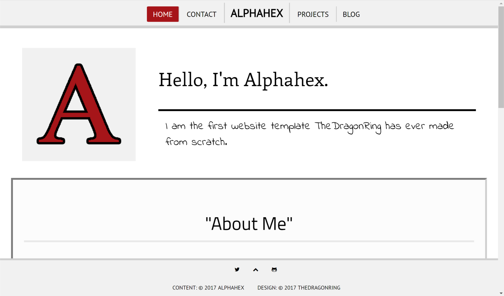

# Alphahex
*A large, responsive website template.*

### Usage
----------
To use Alphahex, simply download the contents of this repository to your site root, and customise it as you wish.

### Features
-------------

- **Responsive** — The website template is built to be both mobile friendly and desktop friendly, with different layouts that should automatically adjust to your screen or windows size (according to the Google Chrome Developer Tools).

- **Scripts** - It comes with a contact form that uses a responsive script to send emails using the mailto function, 'scroll to top' button, an automatically updating copyright (you will have to edit the main.js file to change it to your name!) and content that fades in at a comfortable speed when the page loads (JavaScript/jQuery).

- **Blog** - The template has a self-manageable blog template included, with posts and an RSS feed that are very easy to use and blend in with the look of the rest of the site. None of this is automatic, however.

### Other Details
----------------
Alphahex was originally made to be used on TheDragonRing's website, around January-February 2017. It is licensed under the [MIT License](LICENSE).